

Welcome to the third project of the Machine Learning Engineer Nanodegree! In this notebook, some template code has already been provided for you, and it will be your job to implement the additional functionality necessary to successfully complete this project. Sections that begin with **'Implementation'** in the header indicate that the following block of code will require additional functionality which you must provide. Instructions will be provided for each section and the specifics of the implementation are marked in the code block with a `'TODO'` statement. Please be sure to read the instructions carefully!

In addition to implementing code, there will be questions that you must answer which relate to the project and your implementation. Each section where you will answer a question is preceded by a **'Question X'** header. Carefully read each question and provide thorough answers in the following text boxes that begin with **'Answer:'**. Your project submission will be evaluated based on your answers to each of the questions and the implementation you provide.  

>**Note:** Code and Markdown cells can be executed using the **Shift + Enter** keyboard shortcut. In addition, Markdown cells can be edited by typically double-clicking the cell to enter edit mode.

## Getting Started

In this project, you will analyze a dataset containing data on various customers' annual spending amounts (reported in *monetary units*) of diverse product categories for internal structure. One goal of this project is to best describe the variation in the different types of customers that a wholesale distributor interacts with. Doing so would equip the distributor with insight into how to best structure their delivery service to meet the needs of each customer.

The dataset for this project can be found on the [UCI Machine Learning Repository](https://archive.ics.uci.edu/ml/datasets/Wholesale+customers). For the purposes of this project, the features `'Channel'` and `'Region'` will be excluded in the analysis — with focus instead on the six product categories recorded for customers.

Run the code block below to load the wholesale customers dataset, along with a few of the necessary Python libraries required for this project. You will know the dataset loaded successfully if the size of the dataset is reported.


```python
# Import libraries necessary for this project
import numpy as np
import pandas as pd
from IPython.display import display # Allows the use of display() for DataFrames
import matplotlib.pyplot as plt
import seaborn as sns

# Import supplementary visualizations code visuals.py
import visuals as vs

# Pretty display for notebooks
%matplotlib inline

# Load the wholesale customers dataset
try:
    data = pd.read_csv("customers.csv")
    data.drop(['Region', 'Channel'], axis = 1, inplace = True)
    print "Wholesale customers dataset has {} samples with {} features each.".format(*data.shape)
except:
    print "Dataset could not be loaded. Is the dataset missing?"
```

    Wholesale customers dataset has 440 samples with 6 features each.
    

## Data Exploration
In this section, you will begin exploring the data through visualizations and code to understand how each feature is related to the others. You will observe a statistical description of the dataset, consider the relevance of each feature, and select a few sample data points from the dataset which you will track through the course of this project.

Run the code block below to observe a statistical description of the dataset. Note that the dataset is composed of six important product categories: **'Fresh'**, **'Milk'**, **'Grocery'**, **'Frozen'**, **'Detergents_Paper'**, and **'Delicatessen'**. Consider what each category represents in terms of products you could purchase.


```python
# Display a description of the dataset
display(data.describe())
```


<div>
<style>
    .dataframe thead tr:only-child th {
        text-align: right;
    }

    .dataframe thead th {
        text-align: left;
    }

    .dataframe tbody tr th {
        vertical-align: top;
    }
</style>
<table border="1" class="dataframe">
  <thead>
    <tr style="text-align: right;">
      <th></th>
      <th>Fresh</th>
      <th>Milk</th>
      <th>Grocery</th>
      <th>Frozen</th>
      <th>Detergents_Paper</th>
      <th>Delicatessen</th>
    </tr>
  </thead>
  <tbody>
    <tr>
      <th>count</th>
      <td>440.000000</td>
      <td>440.000000</td>
      <td>440.000000</td>
      <td>440.000000</td>
      <td>440.000000</td>
      <td>440.000000</td>
    </tr>
    <tr>
      <th>mean</th>
      <td>12000.297727</td>
      <td>5796.265909</td>
      <td>7951.277273</td>
      <td>3071.931818</td>
      <td>2881.493182</td>
      <td>1524.870455</td>
    </tr>
    <tr>
      <th>std</th>
      <td>12647.328865</td>
      <td>7380.377175</td>
      <td>9503.162829</td>
      <td>4854.673333</td>
      <td>4767.854448</td>
      <td>2820.105937</td>
    </tr>
    <tr>
      <th>min</th>
      <td>3.000000</td>
      <td>55.000000</td>
      <td>3.000000</td>
      <td>25.000000</td>
      <td>3.000000</td>
      <td>3.000000</td>
    </tr>
    <tr>
      <th>25%</th>
      <td>3127.750000</td>
      <td>1533.000000</td>
      <td>2153.000000</td>
      <td>742.250000</td>
      <td>256.750000</td>
      <td>408.250000</td>
    </tr>
    <tr>
      <th>50%</th>
      <td>8504.000000</td>
      <td>3627.000000</td>
      <td>4755.500000</td>
      <td>1526.000000</td>
      <td>816.500000</td>
      <td>965.500000</td>
    </tr>
    <tr>
      <th>75%</th>
      <td>16933.750000</td>
      <td>7190.250000</td>
      <td>10655.750000</td>
      <td>3554.250000</td>
      <td>3922.000000</td>
      <td>1820.250000</td>
    </tr>
    <tr>
      <th>max</th>
      <td>112151.000000</td>
      <td>73498.000000</td>
      <td>92780.000000</td>
      <td>60869.000000</td>
      <td>40827.000000</td>
      <td>47943.000000</td>
    </tr>
  </tbody>
</table>
</div>


### Implementation: Selecting Samples
To get a better understanding of the customers and how their data will transform through the analysis, it would be best to select a few sample data points and explore them in more detail. In the code block below, add **three** indices of your choice to the `indices` list which will represent the customers to track. It is suggested to try different sets of samples until you obtain customers that vary significantly from one another.


```python
# TODO: Select three indices of your choice you wish to sample from the dataset
sample_indices =  [201,338, 240]

# Create a DataFrame of the chosen samples
samples = pd.DataFrame(data.loc[sample_indices], columns = data.keys()).reset_index(drop = True)
print "Chosen samples of wholesale customers dataset:"
display(samples)
```

    Chosen samples of wholesale customers dataset:
    


<div>
<style>
    .dataframe thead tr:only-child th {
        text-align: right;
    }

    .dataframe thead th {
        text-align: left;
    }

    .dataframe tbody tr th {
        vertical-align: top;
    }
</style>
<table border="1" class="dataframe">
  <thead>
    <tr style="text-align: right;">
      <th></th>
      <th>Fresh</th>
      <th>Milk</th>
      <th>Grocery</th>
      <th>Frozen</th>
      <th>Detergents_Paper</th>
      <th>Delicatessen</th>
    </tr>
  </thead>
  <tbody>
    <tr>
      <th>0</th>
      <td>4484</td>
      <td>14399</td>
      <td>24708</td>
      <td>3549</td>
      <td>14235</td>
      <td>1681</td>
    </tr>
    <tr>
      <th>1</th>
      <td>3</td>
      <td>333</td>
      <td>7021</td>
      <td>15601</td>
      <td>15</td>
      <td>550</td>
    </tr>
    <tr>
      <th>2</th>
      <td>22096</td>
      <td>3575</td>
      <td>7041</td>
      <td>11422</td>
      <td>343</td>
      <td>2564</td>
    </tr>
  </tbody>
</table>
</div>


### Question 1
Consider the total purchase cost of each product category and the statistical description of the dataset above for your sample customers.  
*What kind of establishment (customer) could each of the three samples you've chosen represent?*  
**Hint:** Examples of establishments include places like markets, cafes, and retailers, among many others. Avoid using names for establishments, such as saying *"McDonalds"* when describing a sample customer as a restaurant.


```python
# First, lets Visualize these customers and compare them to the median customer
median = data.apply(np.median, axis = 0)
median.name ='median'
samples2 = samples.append(median)

f, (ax1, ax2, ax3) = plt.subplots(1,3,figsize=(18,5), sharey=True)
samples2.iloc[[0,3],:].transpose().plot(kind="bar", ax=ax1, title="Customer 0 vs. Median customer")
samples2.iloc[[1,3],:].transpose().plot(kind="bar", ax=ax2, title="Customer 1 vs. Median customer")
samples2.iloc[[2,3],:].transpose().plot(kind="bar", ax=ax3, title="Customer 2 vs. Median customer")
```


    <matplotlib.axes._subplots.AxesSubplot at 0xaaedb00>


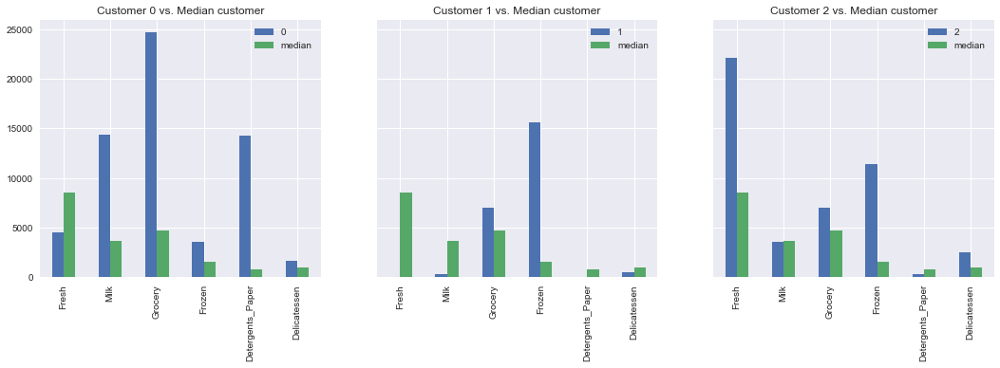


**Answer:**

- **Sample 0:** This establishment could be a supermarket/large grocery store. This is clear from the charts above which show that this establishment carries a diverse range of goods. All categories are well-represented with a huge focus Grocery, Milk and Detergents_Paper where they order >5 times more than the median customer.  

- **Sample 1:** This establishment could be large fast-food restaurant which needs a lot of frozen meats and some groceries (condiments etc.). This is quite clear from the extremely high levels of frozen goods they buy (compared to the median customer) and the slightly above median grocery value. It may also be medium-sized grocery store with a large frozen department or just be the Frozen department of a supermarket (perhaps they get their other products elsewhere and this wholesaler is their main source for frozen).

- **Sample 2:** This establishment could be a Market specializing in fresh foods, with a thriving frozen food section and some groceries as well. 

In general, the samples show purchases across the categories, but the distribution of value across the 3 gives a hint as to their focus. My best guesses are: Large Supermarket, Large Fast-Food Outlet, and Fresh Market for the respective samples.

### Implementation: Feature Relevance
One interesting thought to consider is if one (or more) of the six product categories is actually relevant for understanding customer purchasing. That is to say, is it possible to determine whether customers purchasing some amount of one category of products will necessarily purchase some proportional amount of another category of products? We can make this determination quite easily by training a supervised regression learner on a subset of the data with one feature removed, and then score how well that model can predict the removed feature.

In the code block below, you will need to implement the following:
 - Assign `new_data` a copy of the data by removing a feature of your choice using the `DataFrame.drop` function.
 - Use `sklearn.cross_validation.train_test_split` to split the dataset into training and testing sets.
   - Use the removed feature as your target label. Set a `test_size` of `0.25` and set a `random_state`.
 - Import a decision tree regressor, set a `random_state`, and fit the learner to the training data.
 - Report the prediction score of the testing set using the regressor's `score` function.


```python
# TODO: Make a copy of the DataFrame, using the 'drop' function to drop the given feature
dropped_feature = 'Detergents_Paper'
target = data[dropped_feature]
new_data = data.drop([dropped_feature],axis=1)

# TODO: Split the data into training and testing sets using the given feature as the target
from sklearn.cross_validation import train_test_split
from sklearn.tree import DecisionTreeRegressor

X_train, X_test, y_train, y_test = train_test_split(new_data, target, test_size=0.25, random_state=0)

# TODO: Create a decision tree regressor and fit it to the training set
regressor = DecisionTreeRegressor(random_state=0)
regressor.fit(X_train, y_train)

# TODO: Report the score of the prediction using the testing set
score = regressor.score(X_test, y_test)
print("Predicting {} using the rest of the features: \n----\n The coeficient of determination, R2 score is {}".format(
    dropped_feature, score))
```

    Predicting Detergents_Paper using the rest of the features: 
    ----
     The coeficient of determination, R2 score is 0.728655181254
    

### Question 2
*Which feature did you attempt to predict? What was the reported prediction score? Is this feature is necessary for identifying customers' spending habits?*  
**Hint:** The coefficient of determination, `R^2`, is scored between 0 and 1, with 1 being a perfect fit. A negative `R^2` implies the model fails to fit the data.

**Answer:**

- I chose to predict Detergents_Paper using all the other predictors and the reported score was 0.728655181254 which is significantly higher than 0.5 meaning that a huge portion of the variance or signal in Detergents_Paper is also explained by some of the other existing variables. 
- In particular, the feature importances and the correlation heatmap plot **below** confirm this suspicion. The two categories are strongly positively correlated. 
- So, as long as we have Grocery as a feature, this makes Detergents_Paper somewhat redudant in explaining some of the variations and customer spending habbits since we most of the information it conveys is already captured by Grocery.

Given the above, I would suspect that Detergents_Paper is not very relevant to identify customers spending habbits in this case.


```python
# Exploring the relations with visuals
plt.subplots(1,2,figsize=(18,5))
# We can plot the feature importances to see what's going on
plt.subplot(121)
pd.Series(regressor.feature_importances_, index=new_data.columns).transpose().plot(
    kind="bar", title="Feature Importances for predicting {}".format(dropped_feature))
# We can also confrim this using a heatmap of the correlations
plt.subplot(122)
sns.heatmap(data=data.corr(), annot=True)
```


    <matplotlib.axes._subplots.AxesSubplot at 0xcae4be0>


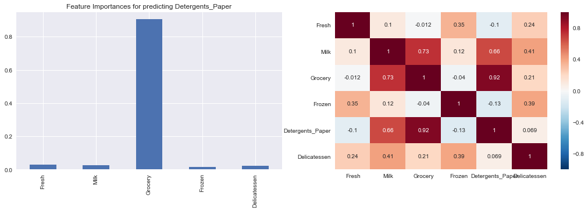


### Visualize Feature Distributions
To get a better understanding of the dataset, we can construct a scatter matrix of each of the six product features present in the data. If you found that the feature you attempted to predict above is relevant for identifying a specific customer, then the scatter matrix below may not show any correlation between that feature and the others. Conversely, if you believe that feature is not relevant for identifying a specific customer, the scatter matrix might show a correlation between that feature and another feature in the data. Run the code block below to produce a scatter matrix.


```python
# Produce a scatter matrix for each pair of features in the data
pd.scatter_matrix(data, alpha = 0.3, figsize = (14,8), diagonal = 'kde');
```

    C:\Anaconda3\envs\python27\lib\site-packages\ipykernel\__main__.py:2: FutureWarning: pandas.scatter_matrix is deprecated. Use pandas.plotting.scatter_matrix instead
      from ipykernel import kernelapp as app
    


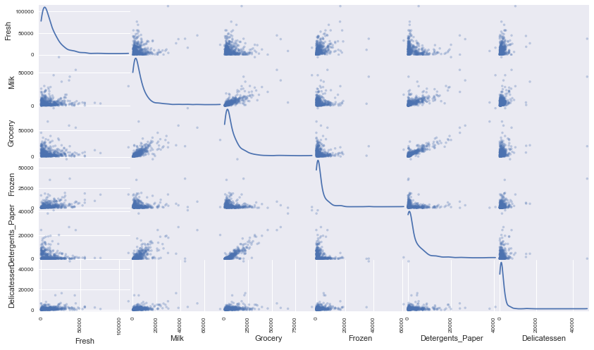


### Question 3
*Are there any pairs of features which exhibit some degree of correlation? Does this confirm or deny your suspicions about the relevance of the feature you attempted to predict? How is the data for those features distributed?*  
**Hint:** Is the data normally distributed? Where do most of the data points lie? 

**Answer:**

Yes there are pairs of features that exhibit some correlations as follows (see heat map and charts above):

**Strong Correlations:**
- Grocery and Detergent_Paper with 0.92 correlation
- Milk and Grocery with 0.73 correlation
- Milk and Detergent_Paper with 0.66 correlation

**Weak Correlations:**
- Milk and Delicatessen with 0.41 correlation
- Frozen and Delicatessen with 0.39 correlation
- Fresh and Frozen with 0.35 correlation

This confirms my suspicion that Detergents_Paper may not be very relevant since it is very strongly correlated (0.92) to Grocery. It also shows that Milk may also contain similar information to Grocery and Detergent_Paper, based on the high correlations.

**Joint Feature Distributions**
The data for the correlated feeatures is distributed in a linear fashion, from the origin and along the diagonal. For the strongly correlated features, this linear distribution is clear to see, but not so much for the weakly correlated features. For the non-corelated features, they seem to generally have a  distribution with the many small values crowded near the origin but also a number of extremely high values scattered as if exploding outwards. From the summary tables produced before, we can see that the means of most of the categories are significantly higher than their median which suggests a wide range in the data (confirmed by looking at the interquartile range) below. This suggests the presence of outliers

**Individual Feature Distributions**
Finally, looking at each individual feature, the distribution is far from normal. In fact, we see that for all of them, their frequency distributions are shaped much like an **exponential distribution** which has a significantly right-skewed (positive-skewed) shape, where most of the values are to the left of the distribution.It is characterized by many small values (to the left) and then a long tail extending to the right for the few very high values. Such a distribution is also prone to outliers.  

## Data Preprocessing
In this section, you will preprocess the data to create a better representation of customers by performing a scaling on the data and detecting (and optionally removing) outliers. Preprocessing data is often times a critical step in assuring that results you obtain from your analysis are significant and meaningful.

### Implementation: Feature Scaling
If data is not normally distributed, especially if the mean and median vary significantly (indicating a large skew), it is most [often appropriate](http://econbrowser.com/archives/2014/02/use-of-logarithms-in-economics) to apply a non-linear scaling — particularly for financial data. One way to achieve this scaling is by using a [Box-Cox test](http://scipy.github.io/devdocs/generated/scipy.stats.boxcox.html), which calculates the best power transformation of the data that reduces skewness. A simpler approach which can work in most cases would be applying the natural logarithm.

In the code block below, you will need to implement the following:
 - Assign a copy of the data to `log_data` after applying logarithmic scaling. Use the `np.log` function for this.
 - Assign a copy of the sample data to `log_samples` after applying logarithmic scaling. Again, use `np.log`.


```python
# TODO: Scale the data using the natural logarithm
log_data = data.apply(np.log)

# TODO: Scale the sample data using the natural logarithm
log_samples = samples.apply(np.log)

# Produce a scatter matrix for each pair of newly-transformed features
pd.scatter_matrix(log_data, alpha = 0.3, figsize = (14,8), diagonal = 'kde');
```

    C:\Anaconda3\envs\python27\lib\site-packages\ipykernel\__main__.py:8: FutureWarning: pandas.scatter_matrix is deprecated. Use pandas.plotting.scatter_matrix instead
    


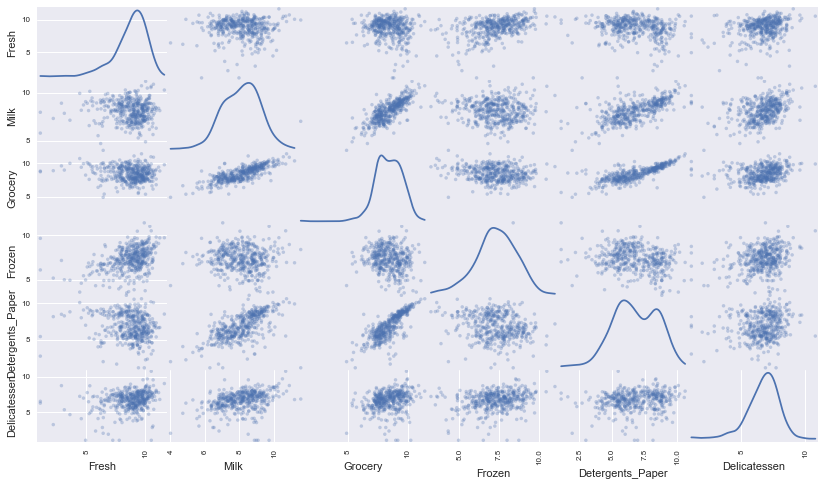


### Observation
After applying a natural logarithm scaling to the data, the distribution of each feature should appear much more normal. For any pairs of features you may have identified earlier as being correlated, observe here whether that correlation is still present (and whether it is now stronger or weaker than before).

Run the code below to see how the sample data has changed after having the natural logarithm applied to it.


```python
# Display the log-transformed sample data
display(log_samples)
```


<div>
<style>
    .dataframe thead tr:only-child th {
        text-align: right;
    }

    .dataframe thead th {
        text-align: left;
    }

    .dataframe tbody tr th {
        vertical-align: top;
    }
</style>
<table border="1" class="dataframe">
  <thead>
    <tr style="text-align: right;">
      <th></th>
      <th>Fresh</th>
      <th>Milk</th>
      <th>Grocery</th>
      <th>Frozen</th>
      <th>Detergents_Paper</th>
      <th>Delicatessen</th>
    </tr>
  </thead>
  <tbody>
    <tr>
      <th>0</th>
      <td>8.408271</td>
      <td>9.574914</td>
      <td>10.114882</td>
      <td>8.174421</td>
      <td>9.563459</td>
      <td>7.427144</td>
    </tr>
    <tr>
      <th>1</th>
      <td>1.098612</td>
      <td>5.808142</td>
      <td>8.856661</td>
      <td>9.655090</td>
      <td>2.708050</td>
      <td>6.309918</td>
    </tr>
    <tr>
      <th>2</th>
      <td>10.003152</td>
      <td>8.181720</td>
      <td>8.859505</td>
      <td>9.343297</td>
      <td>5.837730</td>
      <td>7.849324</td>
    </tr>
  </tbody>
</table>
</div>


### Implementation: Outlier Detection
Detecting outliers in the data is extremely important in the data preprocessing step of any analysis. The presence of outliers can often skew results which take into consideration these data points. There are many "rules of thumb" for what constitutes an outlier in a dataset. Here, we will use [Tukey's Method for identfying outliers](http://datapigtechnologies.com/blog/index.php/highlighting-outliers-in-your-data-with-the-tukey-method/): An *outlier step* is calculated as 1.5 times the interquartile range (IQR). A data point with a feature that is beyond an outlier step outside of the IQR for that feature is considered abnormal.

In the code block below, you will need to implement the following:
 - Assign the value of the 25th percentile for the given feature to `Q1`. Use `np.percentile` for this.
 - Assign the value of the 75th percentile for the given feature to `Q3`. Again, use `np.percentile`.
 - Assign the calculation of an outlier step for the given feature to `step`.
 - Optionally remove data points from the dataset by adding indices to the `outliers` list.

**NOTE:** If you choose to remove any outliers, ensure that the sample data does not contain any of these points!  
Once you have performed this implementation, the dataset will be stored in the variable `good_data`.


```python
# For each feature find the data points with extreme high or low values
# I would like to also remove outliers for in the remove list below(edit the list for different features)
remv_list = ['Grocery', 'Milk' ,'Detergents_Paper']
outliers_dict ={}
for feature in log_data.keys():
    
    # TODO: Calculate Q1 (25th percentile of the data) for the given feature
    Q1 = np.percentile(log_data[feature],25)
    
    # TODO: Calculate Q3 (75th percentile of the data) for the given feature
    Q3 = np.percentile(log_data[feature],75)
    
    # TODO: Use the interquartile range to calculate an outlier step (1.5 times the interquartile range)
    step = 1.5*(Q3-Q1)
    
    # Display the outliers
    print "Data points considered outliers for the feature '{}':".format(feature)
    display(log_data[~((log_data[feature] >= Q1 - step) & (log_data[feature] <= Q3 + step))])
    
    # Add to outlier dictionary to be sorted later
    outliers_dict[feature] = log_data[~((log_data[feature] >= Q1 - step) & 
                                       (log_data[feature] <= Q3 + step))].index.tolist()
# Find the outliers tha appear more than once in the dataset
import collections
col = collections.Counter(np.sum(outliers_dict.values()))
common_outliers_count = {}
for key in col.keys():
    if col[key]>1:
        common_outliers_count[key] = col[key]
    
# OPTIONAL: Select the indices for data points you wish to remove
outliers  = np.sum([outliers_dict[x] for x in remv_list])+ common_outliers_count.keys()
# Make sure we are not removing our sample customers from the data!
outliers = [x for x in outliers if x not in sample_indices]
print("\n-----\nAll outliers:\n {} \n-----\n Common Outliers Count:\n {}  \
\n-----\nOutliers selected for removal: {}".format(outliers_dict, common_outliers_count, outliers))

# Remove the outliers, if any were specified
good_data = log_data.drop(log_data.index[outliers]).reset_index(drop = True)
```

    Data points considered outliers for the feature 'Fresh':
    


<div>
<style>
    .dataframe thead tr:only-child th {
        text-align: right;
    }

    .dataframe thead th {
        text-align: left;
    }

    .dataframe tbody tr th {
        vertical-align: top;
    }
</style>
<table border="1" class="dataframe">
  <thead>
    <tr style="text-align: right;">
      <th></th>
      <th>Fresh</th>
      <th>Milk</th>
      <th>Grocery</th>
      <th>Frozen</th>
      <th>Detergents_Paper</th>
      <th>Delicatessen</th>
    </tr>
  </thead>
  <tbody>
    <tr>
      <th>65</th>
      <td>4.442651</td>
      <td>9.950323</td>
      <td>10.732651</td>
      <td>3.583519</td>
      <td>10.095388</td>
      <td>7.260523</td>
    </tr>
    <tr>
      <th>66</th>
      <td>2.197225</td>
      <td>7.335634</td>
      <td>8.911530</td>
      <td>5.164786</td>
      <td>8.151333</td>
      <td>3.295837</td>
    </tr>
    <tr>
      <th>81</th>
      <td>5.389072</td>
      <td>9.163249</td>
      <td>9.575192</td>
      <td>5.645447</td>
      <td>8.964184</td>
      <td>5.049856</td>
    </tr>
    <tr>
      <th>95</th>
      <td>1.098612</td>
      <td>7.979339</td>
      <td>8.740657</td>
      <td>6.086775</td>
      <td>5.407172</td>
      <td>6.563856</td>
    </tr>
    <tr>
      <th>96</th>
      <td>3.135494</td>
      <td>7.869402</td>
      <td>9.001839</td>
      <td>4.976734</td>
      <td>8.262043</td>
      <td>5.379897</td>
    </tr>
    <tr>
      <th>128</th>
      <td>4.941642</td>
      <td>9.087834</td>
      <td>8.248791</td>
      <td>4.955827</td>
      <td>6.967909</td>
      <td>1.098612</td>
    </tr>
    <tr>
      <th>171</th>
      <td>5.298317</td>
      <td>10.160530</td>
      <td>9.894245</td>
      <td>6.478510</td>
      <td>9.079434</td>
      <td>8.740337</td>
    </tr>
    <tr>
      <th>193</th>
      <td>5.192957</td>
      <td>8.156223</td>
      <td>9.917982</td>
      <td>6.865891</td>
      <td>8.633731</td>
      <td>6.501290</td>
    </tr>
    <tr>
      <th>218</th>
      <td>2.890372</td>
      <td>8.923191</td>
      <td>9.629380</td>
      <td>7.158514</td>
      <td>8.475746</td>
      <td>8.759669</td>
    </tr>
    <tr>
      <th>304</th>
      <td>5.081404</td>
      <td>8.917311</td>
      <td>10.117510</td>
      <td>6.424869</td>
      <td>9.374413</td>
      <td>7.787382</td>
    </tr>
    <tr>
      <th>305</th>
      <td>5.493061</td>
      <td>9.468001</td>
      <td>9.088399</td>
      <td>6.683361</td>
      <td>8.271037</td>
      <td>5.351858</td>
    </tr>
    <tr>
      <th>338</th>
      <td>1.098612</td>
      <td>5.808142</td>
      <td>8.856661</td>
      <td>9.655090</td>
      <td>2.708050</td>
      <td>6.309918</td>
    </tr>
    <tr>
      <th>353</th>
      <td>4.762174</td>
      <td>8.742574</td>
      <td>9.961898</td>
      <td>5.429346</td>
      <td>9.069007</td>
      <td>7.013016</td>
    </tr>
    <tr>
      <th>355</th>
      <td>5.247024</td>
      <td>6.588926</td>
      <td>7.606885</td>
      <td>5.501258</td>
      <td>5.214936</td>
      <td>4.844187</td>
    </tr>
    <tr>
      <th>357</th>
      <td>3.610918</td>
      <td>7.150701</td>
      <td>10.011086</td>
      <td>4.919981</td>
      <td>8.816853</td>
      <td>4.700480</td>
    </tr>
    <tr>
      <th>412</th>
      <td>4.574711</td>
      <td>8.190077</td>
      <td>9.425452</td>
      <td>4.584967</td>
      <td>7.996317</td>
      <td>4.127134</td>
    </tr>
  </tbody>
</table>
</div>


    Data points considered outliers for the feature 'Milk':
    


<div>
<style>
    .dataframe thead tr:only-child th {
        text-align: right;
    }

    .dataframe thead th {
        text-align: left;
    }

    .dataframe tbody tr th {
        vertical-align: top;
    }
</style>
<table border="1" class="dataframe">
  <thead>
    <tr style="text-align: right;">
      <th></th>
      <th>Fresh</th>
      <th>Milk</th>
      <th>Grocery</th>
      <th>Frozen</th>
      <th>Detergents_Paper</th>
      <th>Delicatessen</th>
    </tr>
  </thead>
  <tbody>
    <tr>
      <th>86</th>
      <td>10.039983</td>
      <td>11.205013</td>
      <td>10.377047</td>
      <td>6.894670</td>
      <td>9.906981</td>
      <td>6.805723</td>
    </tr>
    <tr>
      <th>98</th>
      <td>6.220590</td>
      <td>4.718499</td>
      <td>6.656727</td>
      <td>6.796824</td>
      <td>4.025352</td>
      <td>4.882802</td>
    </tr>
    <tr>
      <th>154</th>
      <td>6.432940</td>
      <td>4.007333</td>
      <td>4.919981</td>
      <td>4.317488</td>
      <td>1.945910</td>
      <td>2.079442</td>
    </tr>
    <tr>
      <th>356</th>
      <td>10.029503</td>
      <td>4.897840</td>
      <td>5.384495</td>
      <td>8.057377</td>
      <td>2.197225</td>
      <td>6.306275</td>
    </tr>
  </tbody>
</table>
</div>


    Data points considered outliers for the feature 'Grocery':
    


<div>
<style>
    .dataframe thead tr:only-child th {
        text-align: right;
    }

    .dataframe thead th {
        text-align: left;
    }

    .dataframe tbody tr th {
        vertical-align: top;
    }
</style>
<table border="1" class="dataframe">
  <thead>
    <tr style="text-align: right;">
      <th></th>
      <th>Fresh</th>
      <th>Milk</th>
      <th>Grocery</th>
      <th>Frozen</th>
      <th>Detergents_Paper</th>
      <th>Delicatessen</th>
    </tr>
  </thead>
  <tbody>
    <tr>
      <th>75</th>
      <td>9.923192</td>
      <td>7.036148</td>
      <td>1.098612</td>
      <td>8.390949</td>
      <td>1.098612</td>
      <td>6.882437</td>
    </tr>
    <tr>
      <th>154</th>
      <td>6.432940</td>
      <td>4.007333</td>
      <td>4.919981</td>
      <td>4.317488</td>
      <td>1.945910</td>
      <td>2.079442</td>
    </tr>
  </tbody>
</table>
</div>


    Data points considered outliers for the feature 'Frozen':
    


<div>
<style>
    .dataframe thead tr:only-child th {
        text-align: right;
    }

    .dataframe thead th {
        text-align: left;
    }

    .dataframe tbody tr th {
        vertical-align: top;
    }
</style>
<table border="1" class="dataframe">
  <thead>
    <tr style="text-align: right;">
      <th></th>
      <th>Fresh</th>
      <th>Milk</th>
      <th>Grocery</th>
      <th>Frozen</th>
      <th>Detergents_Paper</th>
      <th>Delicatessen</th>
    </tr>
  </thead>
  <tbody>
    <tr>
      <th>38</th>
      <td>8.431853</td>
      <td>9.663261</td>
      <td>9.723703</td>
      <td>3.496508</td>
      <td>8.847360</td>
      <td>6.070738</td>
    </tr>
    <tr>
      <th>57</th>
      <td>8.597297</td>
      <td>9.203618</td>
      <td>9.257892</td>
      <td>3.637586</td>
      <td>8.932213</td>
      <td>7.156177</td>
    </tr>
    <tr>
      <th>65</th>
      <td>4.442651</td>
      <td>9.950323</td>
      <td>10.732651</td>
      <td>3.583519</td>
      <td>10.095388</td>
      <td>7.260523</td>
    </tr>
    <tr>
      <th>145</th>
      <td>10.000569</td>
      <td>9.034080</td>
      <td>10.457143</td>
      <td>3.737670</td>
      <td>9.440738</td>
      <td>8.396155</td>
    </tr>
    <tr>
      <th>175</th>
      <td>7.759187</td>
      <td>8.967632</td>
      <td>9.382106</td>
      <td>3.951244</td>
      <td>8.341887</td>
      <td>7.436617</td>
    </tr>
    <tr>
      <th>264</th>
      <td>6.978214</td>
      <td>9.177714</td>
      <td>9.645041</td>
      <td>4.110874</td>
      <td>8.696176</td>
      <td>7.142827</td>
    </tr>
    <tr>
      <th>325</th>
      <td>10.395650</td>
      <td>9.728181</td>
      <td>9.519735</td>
      <td>11.016479</td>
      <td>7.148346</td>
      <td>8.632128</td>
    </tr>
    <tr>
      <th>420</th>
      <td>8.402007</td>
      <td>8.569026</td>
      <td>9.490015</td>
      <td>3.218876</td>
      <td>8.827321</td>
      <td>7.239215</td>
    </tr>
    <tr>
      <th>429</th>
      <td>9.060331</td>
      <td>7.467371</td>
      <td>8.183118</td>
      <td>3.850148</td>
      <td>4.430817</td>
      <td>7.824446</td>
    </tr>
    <tr>
      <th>439</th>
      <td>7.932721</td>
      <td>7.437206</td>
      <td>7.828038</td>
      <td>4.174387</td>
      <td>6.167516</td>
      <td>3.951244</td>
    </tr>
  </tbody>
</table>
</div>


    Data points considered outliers for the feature 'Detergents_Paper':
    


<div>
<style>
    .dataframe thead tr:only-child th {
        text-align: right;
    }

    .dataframe thead th {
        text-align: left;
    }

    .dataframe tbody tr th {
        vertical-align: top;
    }
</style>
<table border="1" class="dataframe">
  <thead>
    <tr style="text-align: right;">
      <th></th>
      <th>Fresh</th>
      <th>Milk</th>
      <th>Grocery</th>
      <th>Frozen</th>
      <th>Detergents_Paper</th>
      <th>Delicatessen</th>
    </tr>
  </thead>
  <tbody>
    <tr>
      <th>75</th>
      <td>9.923192</td>
      <td>7.036148</td>
      <td>1.098612</td>
      <td>8.390949</td>
      <td>1.098612</td>
      <td>6.882437</td>
    </tr>
    <tr>
      <th>161</th>
      <td>9.428190</td>
      <td>6.291569</td>
      <td>5.645447</td>
      <td>6.995766</td>
      <td>1.098612</td>
      <td>7.711101</td>
    </tr>
  </tbody>
</table>
</div>


    Data points considered outliers for the feature 'Delicatessen':
    


<div>
<style>
    .dataframe thead tr:only-child th {
        text-align: right;
    }

    .dataframe thead th {
        text-align: left;
    }

    .dataframe tbody tr th {
        vertical-align: top;
    }
</style>
<table border="1" class="dataframe">
  <thead>
    <tr style="text-align: right;">
      <th></th>
      <th>Fresh</th>
      <th>Milk</th>
      <th>Grocery</th>
      <th>Frozen</th>
      <th>Detergents_Paper</th>
      <th>Delicatessen</th>
    </tr>
  </thead>
  <tbody>
    <tr>
      <th>66</th>
      <td>2.197225</td>
      <td>7.335634</td>
      <td>8.911530</td>
      <td>5.164786</td>
      <td>8.151333</td>
      <td>3.295837</td>
    </tr>
    <tr>
      <th>109</th>
      <td>7.248504</td>
      <td>9.724899</td>
      <td>10.274568</td>
      <td>6.511745</td>
      <td>6.728629</td>
      <td>1.098612</td>
    </tr>
    <tr>
      <th>128</th>
      <td>4.941642</td>
      <td>9.087834</td>
      <td>8.248791</td>
      <td>4.955827</td>
      <td>6.967909</td>
      <td>1.098612</td>
    </tr>
    <tr>
      <th>137</th>
      <td>8.034955</td>
      <td>8.997147</td>
      <td>9.021840</td>
      <td>6.493754</td>
      <td>6.580639</td>
      <td>3.583519</td>
    </tr>
    <tr>
      <th>142</th>
      <td>10.519646</td>
      <td>8.875147</td>
      <td>9.018332</td>
      <td>8.004700</td>
      <td>2.995732</td>
      <td>1.098612</td>
    </tr>
    <tr>
      <th>154</th>
      <td>6.432940</td>
      <td>4.007333</td>
      <td>4.919981</td>
      <td>4.317488</td>
      <td>1.945910</td>
      <td>2.079442</td>
    </tr>
    <tr>
      <th>183</th>
      <td>10.514529</td>
      <td>10.690808</td>
      <td>9.911952</td>
      <td>10.505999</td>
      <td>5.476464</td>
      <td>10.777768</td>
    </tr>
    <tr>
      <th>184</th>
      <td>5.789960</td>
      <td>6.822197</td>
      <td>8.457443</td>
      <td>4.304065</td>
      <td>5.811141</td>
      <td>2.397895</td>
    </tr>
    <tr>
      <th>187</th>
      <td>7.798933</td>
      <td>8.987447</td>
      <td>9.192075</td>
      <td>8.743372</td>
      <td>8.148735</td>
      <td>1.098612</td>
    </tr>
    <tr>
      <th>203</th>
      <td>6.368187</td>
      <td>6.529419</td>
      <td>7.703459</td>
      <td>6.150603</td>
      <td>6.860664</td>
      <td>2.890372</td>
    </tr>
    <tr>
      <th>233</th>
      <td>6.871091</td>
      <td>8.513988</td>
      <td>8.106515</td>
      <td>6.842683</td>
      <td>6.013715</td>
      <td>1.945910</td>
    </tr>
    <tr>
      <th>285</th>
      <td>10.602965</td>
      <td>6.461468</td>
      <td>8.188689</td>
      <td>6.948897</td>
      <td>6.077642</td>
      <td>2.890372</td>
    </tr>
    <tr>
      <th>289</th>
      <td>10.663966</td>
      <td>5.655992</td>
      <td>6.154858</td>
      <td>7.235619</td>
      <td>3.465736</td>
      <td>3.091042</td>
    </tr>
    <tr>
      <th>343</th>
      <td>7.431892</td>
      <td>8.848509</td>
      <td>10.177932</td>
      <td>7.283448</td>
      <td>9.646593</td>
      <td>3.610918</td>
    </tr>
  </tbody>
</table>
</div>


    
    -----
    All outliers:
     {'Grocery': [75, 154], 'Frozen': [38, 57, 65, 145, 175, 264, 325, 420, 429, 439], 'Delicatessen': [66, 109, 128, 137, 142, 154, 183, 184, 187, 203, 233, 285, 289, 343], 'Detergents_Paper': [75, 161], 'Fresh': [65, 66, 81, 95, 96, 128, 171, 193, 218, 304, 305, 338, 353, 355, 357, 412], 'Milk': [86, 98, 154, 356]} 
    -----
     Common Outliers Count:
     {128: 2, 65: 2, 154: 3, 75: 2, 66: 2}  
    -----
    Outliers selected for removal: [75, 154, 86, 98, 154, 356, 75, 161, 128, 65, 154, 75, 66]
    

### Question 4
*Are there any data points considered outliers for more than one feature based on the definition above? Should these data points be removed from the dataset? If any data points were added to the `outliers` list to be removed, explain why.* 


```python
# Show the outliers that appear more than once in the dataset (already calculated)
common_outliers_count
```


    {65: 2, 66: 2, 75: 2, 128: 2, 154: 3}


**Answer:**

- Yes, there are 5 data points (shown above) that are considered to be outliers for more than one feature based on the definition of an outlier. These outliers should be removed from the dataset because they would not be useful in determing or learning about the spending patterns of the core group of customers. Also, they are only 5 out of total 470 points with extreme values in multiple categories which implies that they are not representative of the patterns we should expect to see in customer spending. 

- To my outliers list, I added the 5 data points above as well as those from categories that had a low number of outliers overall i.e. Grocery, Milk and Detergents_Paper. Some of the outliers were both from a category that had few outliers and would appear in multiple categories. I think this allows me to throw out a small number of extreme values which cause problems across all categories, while not throwing away too much data that might actually contain some signal/information about spending habbits. So for categories like Fresh, Delicatessen and Frozen I decided to keep the outliers in because there were quite a number of them (10,14, 16 respectively) such that they could actually indicate some meaningful spending patterns. See chart below for number of outliers in each category


```python
# Number of outliers in each category - shown below
d = {x:len(outliers_dict[x]) for x in outliers_dict}
s = pd.Series(d.values(), index=d.keys())
s.plot(kind="bar")
```


    <matplotlib.axes._subplots.AxesSubplot at 0xef66358>


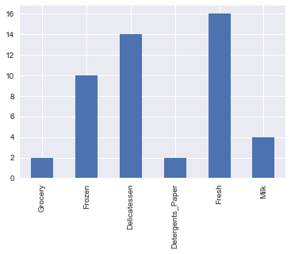


## Feature Transformation
In this section you will use principal component analysis (PCA) to draw conclusions about the underlying structure of the wholesale customer data. Since using PCA on a dataset calculates the dimensions which best maximize variance, we will find which compound combinations of features best describe customers.

### Implementation: PCA

Now that the data has been scaled to a more normal distribution and has had any necessary outliers removed, we can now apply PCA to the `good_data` to discover which dimensions about the data best maximize the variance of features involved. In addition to finding these dimensions, PCA will also report the *explained variance ratio* of each dimension — how much variance within the data is explained by that dimension alone. Note that a component (dimension) from PCA can be considered a new "feature" of the space, however it is a composition of the original features present in the data.

In the code block below, you will need to implement the following:
 - Import `sklearn.decomposition.PCA` and assign the results of fitting PCA in six dimensions with `good_data` to `pca`.
 - Apply a PCA transformation of `log_samples` using `pca.transform`, and assign the results to `pca_samples`.


```python
# TODO: Apply PCA by fitting the good data with the same number of dimensions as features
from sklearn.decomposition import PCA
pca = PCA(n_components = 6)
pca.fit(good_data)

# TODO: Transform log_samples using the PCA fit above
pca_samples = pca.transform(log_samples)

# Generate PCA results plot
pca_results = vs.pca_results(good_data, pca)
```


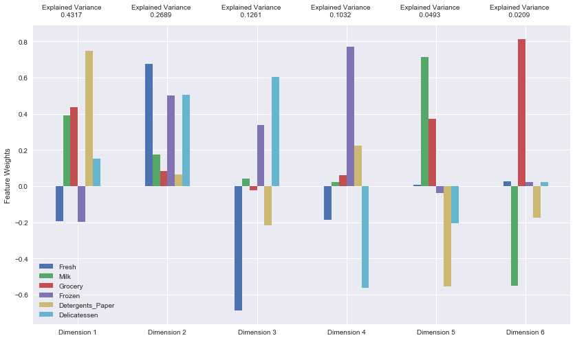


### Question 5
*How much variance in the data is explained* ***in total*** *by the first and second principal component? What about the first four principal components? Using the visualization provided above, discuss what the first four dimensions best represent in terms of customer spending.*  
**Hint:** A positive increase in a specific dimension corresponds with an *increase* of the *positive-weighted* features and a *decrease* of the *negative-weighted* features. The rate of increase or decrease is based on the indivdual feature weights.


```python
# Display the ratio of variance explained
print("Variance explained by PC1 and PC2: {}".format(sum(pca.explained_variance_ratio_[:2])))
print("Variance explained by first four PCs: {}".format(sum(pca.explained_variance_ratio_[:4])))
```

    Variance explained by PC1 and PC2: 0.700581667973
    Variance explained by first four PCs: 0.929878116017
    

**Answer:**

** Explained Variance**

- The first and second principal components explain ~ 70% (see above) of the total variance in the data, which is quite significant

- The first four principal components explained almost ~93% (see above) of the data which is almost all of the variance in the data!

**Customer Spending in the the four major dimensions**

- **PC1**: This dimension explains about 43% of the variance in the data. It terms of customer spending, it represents the customers who dominantly spend on the Detergents_Paper category. They will also spend on the Grocery and Milk category with a a little bit of Delicatessen. They are unlikely to spend on the Fresh and Frozen categories.

- **PC2**: This dimension explains about 27% of the variance in the data. This dimension shows customers who spend heavily on the Fresh category, and quite significantly on the Frozen and Delicatessen. They also spend on Milk, Grocery, and Detergents_Paper but at much lower rates. This would be the only customer group that actually spends across all categories.

- **PC3**: This dimension explains about 13% of the variance in the data. This dimension represents customers who mostly spend on Delicatessen and Frozen categories, with Delicatessen being the major focus. They almost never buy anything from Fresh and rarely buy anything from the Detergents_Paper category.

- **PC4**: This dimension explains about 10% of the variance in the data. This dimension represents customers who mostly buy from the Frozen category and almost never from the Delicatessen.They would sometimes buy from the Detergents_Paper category but rarely from the Fresh category. Very little spending on Grocery and Milk.

### Observation
Run the code below to see how the log-transformed sample data has changed after having a PCA transformation applied to it in six dimensions. Observe the numerical value for the first four dimensions of the sample points. Consider if this is consistent with your initial interpretation of the sample points.


```python
# Display sample log-data after having a PCA transformation applied
display(pd.DataFrame(np.round(pca_samples, 4), columns = pca_results.index.values))
```


<div>
<style>
    .dataframe thead tr:only-child th {
        text-align: right;
    }

    .dataframe thead th {
        text-align: left;
    }

    .dataframe tbody tr th {
        vertical-align: top;
    }
</style>
<table border="1" class="dataframe">
  <thead>
    <tr style="text-align: right;">
      <th></th>
      <th>Dimension 1</th>
      <th>Dimension 2</th>
      <th>Dimension 3</th>
      <th>Dimension 4</th>
      <th>Dimension 5</th>
      <th>Dimension 6</th>
    </tr>
  </thead>
  <tbody>
    <tr>
      <th>0</th>
      <td>3.3347</td>
      <td>1.1162</td>
      <td>0.3896</td>
      <td>1.0560</td>
      <td>-0.0731</td>
      <td>0.0847</td>
    </tr>
    <tr>
      <th>1</th>
      <td>-2.8528</td>
      <td>-4.8383</td>
      <td>6.6204</td>
      <td>2.4967</td>
      <td>0.7073</td>
      <td>2.1805</td>
    </tr>
    <tr>
      <th>2</th>
      <td>-1.0159</td>
      <td>2.3993</td>
      <td>0.7306</td>
      <td>0.4852</td>
      <td>0.4159</td>
      <td>0.5653</td>
    </tr>
  </tbody>
</table>
</div>


### Implementation: Dimensionality Reduction
When using principal component analysis, one of the main goals is to reduce the dimensionality of the data — in effect, reducing the complexity of the problem. Dimensionality reduction comes at a cost: Fewer dimensions used implies less of the total variance in the data is being explained. Because of this, the *cumulative explained variance ratio* is extremely important for knowing how many dimensions are necessary for the problem. Additionally, if a signifiant amount of variance is explained by only two or three dimensions, the reduced data can be visualized afterwards.

In the code block below, you will need to implement the following:
 - Assign the results of fitting PCA in two dimensions with `good_data` to `pca`.
 - Apply a PCA transformation of `good_data` using `pca.transform`, and assign the results to `reduced_data`.
 - Apply a PCA transformation of `log_samples` using `pca.transform`, and assign the results to `pca_samples`.


```python
# TODO: Apply PCA by fitting the good data with only two dimensions
pca = PCA(n_components=2).fit(good_data)

# TODO: Transform the good data using the PCA fit above
reduced_data = pca.transform(good_data)

# TODO: Transform log_samples using the PCA fit above
pca_samples = pca.transform(log_samples)

# Create a DataFrame for the reduced data
reduced_data = pd.DataFrame(reduced_data, columns = ['Dimension 1', 'Dimension 2'])
```

### Observation
Run the code below to see how the log-transformed sample data has changed after having a PCA transformation applied to it using only two dimensions. Observe how the values for the first two dimensions remains unchanged when compared to a PCA transformation in six dimensions.


```python
# Display sample log-data after applying PCA transformation in two dimensions
display(pd.DataFrame(np.round(pca_samples, 4), columns = ['Dimension 1', 'Dimension 2']))
```


<div>
<style>
    .dataframe thead tr:only-child th {
        text-align: right;
    }

    .dataframe thead th {
        text-align: left;
    }

    .dataframe tbody tr th {
        vertical-align: top;
    }
</style>
<table border="1" class="dataframe">
  <thead>
    <tr style="text-align: right;">
      <th></th>
      <th>Dimension 1</th>
      <th>Dimension 2</th>
    </tr>
  </thead>
  <tbody>
    <tr>
      <th>0</th>
      <td>3.3347</td>
      <td>1.1162</td>
    </tr>
    <tr>
      <th>1</th>
      <td>-2.8528</td>
      <td>-4.8383</td>
    </tr>
    <tr>
      <th>2</th>
      <td>-1.0159</td>
      <td>2.3993</td>
    </tr>
  </tbody>
</table>
</div>


## Visualizing a Biplot
A biplot is a scatterplot where each data point is represented by its scores along the principal components. The axes are the principal components (in this case `Dimension 1` and `Dimension 2`). In addition, the biplot shows the projection of the original features along the components. A biplot can help us interpret the reduced dimensions of the data, and discover relationships between the principal components and original features.

Run the code cell below to produce a biplot of the reduced-dimension data.


```python
# Create a biplot
vs.biplot(good_data, reduced_data, pca)
```


    <matplotlib.axes._subplots.AxesSubplot at 0xf0a6a58>


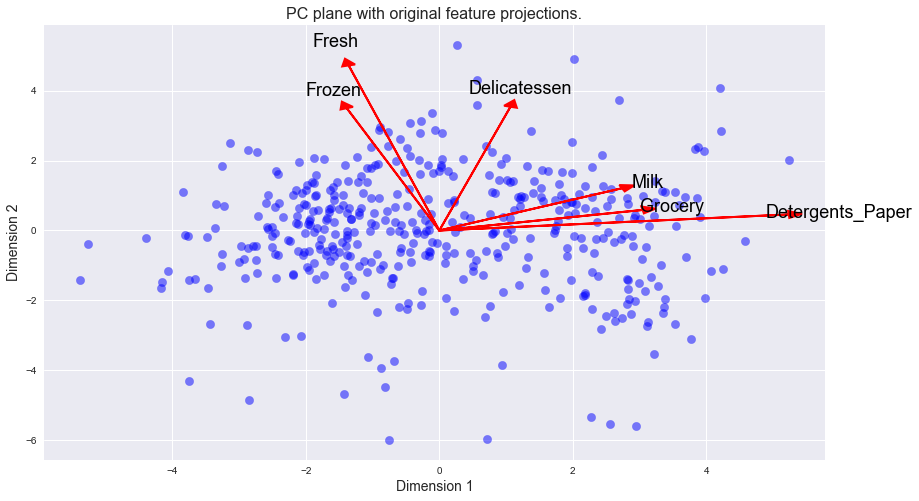


### Observation

Once we have the original feature projections (in red), it is easier to interpret the relative position of each data point in the scatterplot. For instance, a point the lower right corner of the figure will likely correspond to a customer that spends a lot on `'Milk'`, `'Grocery'` and `'Detergents_Paper'`, but not so much on the other product categories. 

From the biplot, which of the original features are most strongly correlated with the first component? What about those that are associated with the second component? Do these observations agree with the pca_results plot you obtained earlier?

## Clustering

In this section, you will choose to use either a K-Means clustering algorithm or a Gaussian Mixture Model clustering algorithm to identify the various customer segments hidden in the data. You will then recover specific data points from the clusters to understand their significance by transforming them back into their original dimension and scale. 

### Question 6
*What are the advantages to using a K-Means clustering algorithm? What are the advantages to using a Gaussian Mixture Model clustering algorithm? Given your observations about the wholesale customer data so far, which of the two algorithms will you use and why?*

**Answer:**

**Advantages of using KMeans Clustering**

- It is fast, and efficient to implement KMeans algorithms. The time complexity is linear and thus depends on n, the number of observations in the data. This means it is well-suited for large datasets.

- The clustering results from KMeans are usually clear, unambiguous and readily accessible/intepretable

- Although a lot of assumptions may not hold for real sceanarios, KMeans still work very well in practice

**Advantages of using Gaussian Mixed Model Clustering**

- It is flexible: it is not restricted to the clustering according to distance but rather according to probability. Thus it allows more flexibility in terms of cluster covariance and the shape of the cluster is not restricted to a sphere/circle. It does not have to assume that features are independent of each other (a very rare occurrence in the real world).

- It allows for multi-class membership to varying degrees: GMM is not deterministic and thus assigns each point a probability that it belongs to each of the classes, eventually clustering it in the cluster with highest probability. This allows it to deal well with real-world situations where membership to a cluster can be ambiguous or mixed.


Given what I know so far, I think the Gaussian Mixed Model would be more approapriate to apply to the wholesale data because we have already observed some high correlations among the features which may indicate the presence of some hidden, latent variables that may not be measurable but are showing up in the interactions between the variables. Additionally, it is clear that there are some data points that have strong influence from several feautures which will require a flexible, probablistic model to do the clustering as opposed to KMeans which is a deterministic model with less flexibility for observations to belong to several clusters to varying degrees. Additionally, we don't know if the clusters are spherical so we need GMM for the flexibility. 

### Implementation: Creating Clusters
Depending on the problem, the number of clusters that you expect to be in the data may already be known. When the number of clusters is not known *a priori*, there is no guarantee that a given number of clusters best segments the data, since it is unclear what structure exists in the data — if any. However, we can quantify the "goodness" of a clustering by calculating each data point's *silhouette coefficient*. The [silhouette coefficient](http://scikit-learn.org/stable/modules/generated/sklearn.metrics.silhouette_score.html) for a data point measures how similar it is to its assigned cluster from -1 (dissimilar) to 1 (similar). Calculating the *mean* silhouette coefficient provides for a simple scoring method of a given clustering.

In the code block below, you will need to implement the following:
 - Fit a clustering algorithm to the `reduced_data` and assign it to `clusterer`.
 - Predict the cluster for each data point in `reduced_data` using `clusterer.predict` and assign them to `preds`.
 - Find the cluster centers using the algorithm's respective attribute and assign them to `centers`.
 - Predict the cluster for each sample data point in `pca_samples` and assign them `sample_preds`.
 - Import `sklearn.metrics.silhouette_score` and calculate the silhouette score of `reduced_data` against `preds`.
   - Assign the silhouette score to `score` and print the result.


```python
# TODO: Apply your clustering algorithm of choice to the reduced data 
#from sklearn.cluster import KMeans
from sklearn.mixture import GMM
from sklearn.metrics import silhouette_score
clusterer = GMM(n_components= 2, random_state=0)
clusterer.fit(reduced_data)

# TODO: Predict the cluster for each data point
preds = clusterer.predict(reduced_data)

# TODO: Find the cluster centers
centers = clusterer.means_

# TODO: Predict the cluster for each transformed sample data point
sample_preds = clusterer.predict(pca_samples)

# TODO: Calculate the mean silhouette coefficient for the number of clusters chosen
score = silhouette_score(reduced_data, preds)
```

### Question 7
*Report the silhouette score for several cluster numbers you tried. Of these, which number of clusters has the best silhouette score?* 


```python
# Make reusable function to campare silhouette score across number of clusters and even different estimators
def nClusterScores(estimator, data, samples):
    from sklearn.cluster import KMeans
    from sklearn.mixture import GMM
    from sklearn.metrics import silhouette_score
    
    scores =[]
    clusters = []
    for i in range(2,7):
        # fit and predict
        clusterer = estimator(i)
        clusterer.fit(reduced_data)
        preds = clusterer.predict(reduced_data)
        scores.append(silhouette_score(data, preds))
        clusters.append(i)
    print("\nSilhouette Scores for {}:\n------\n".format(estimator))
    print(zip(clusters,scores))
    # plot results
    plt.plot(clusters, scores)
    plt.title(estimator)
    plt.xlabel("Number of Clusters")
    plt.ylabel("Silhouette Score")
    plt.ylim(0,1)    
```


```python
# Let's plot the silhouhette scores using the resuable function for both KMeans and GMM
from sklearn.cluster import KMeans
from sklearn.mixture import GMM
plt.subplots(1,2,figsize=(15,5))
plt.subplot(121)
nClusterScores(GMM, reduced_data, pca_samples)
plt.subplot(122)
nClusterScores(KMeans, reduced_data, pca_samples)
```

    
    Silhouette Scores for <class 'sklearn.mixture.gmm.GMM'>:
    ------
    
    [(2, 0.41744547874080407), (3, 0.3967595409112693), (4, 0.31467098198049664), (5, 0.28579994544927145), (6, 0.30618522529743647)]
    
    Silhouette Scores for <class 'sklearn.cluster.k_means_.KMeans'>:
    ------
    
    [(2, 0.42785332169702239), (3, 0.39980825296960515), (4, 0.33414976472015556), (5, 0.35460313911104024), (6, 0.36886031662615065)]
    


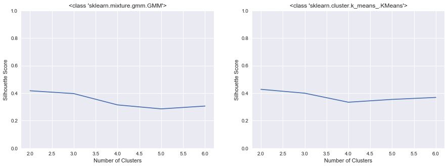


**Answer:**

- From trying all the number of clusters from 2 to 6 for Gaussian Mixed Models (see left chart above), we get the following pairs of number of cluster and score respectively. 
    
    (2, 0.41744547874080407), (3, 0.3967595409112693), (4, 0.31315093671640665), (5, 0.31114721881568558), (6, 0.30849276659583047)


- 2 clusters appear to be the best as they give the highest score, which means that the customers in each cluster are more similar to each other when you have two clusters than when you have any other number of clusters.
- This number of clusters (2) also seems to be the best choice even for the KMeans clustering algorithm (see right chart above), thus this validates our findings. Also notice that KMeans achieves a slightly higher Silhouette score than GMM for 2 clusters, but the difference is miniscule.

### Cluster Visualization
Once you've chosen the optimal number of clusters for your clustering algorithm using the scoring metric above, you can now visualize the results by executing the code block below. Note that, for experimentation purposes, you are welcome to adjust the number of clusters for your clustering algorithm to see various visualizations. The final visualization provided should, however, correspond with the optimal number of clusters. 


```python
# Display the results of the clustering from implementation
vs.cluster_results(reduced_data, preds, centers, pca_samples)
```


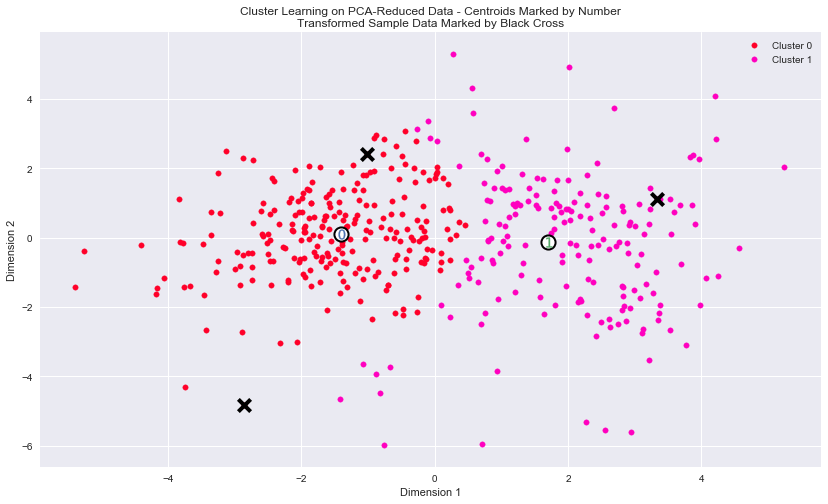


### Implementation: Data Recovery
Each cluster present in the visualization above has a central point. These centers (or means) are not specifically data points from the data, but rather the *averages* of all the data points predicted in the respective clusters. For the problem of creating customer segments, a cluster's center point corresponds to *the average customer of that segment*. Since the data is currently reduced in dimension and scaled by a logarithm, we can recover the representative customer spending from these data points by applying the inverse transformations.

In the code block below, you will need to implement the following:
 - Apply the inverse transform to `centers` using `pca.inverse_transform` and assign the new centers to `log_centers`.
 - Apply the inverse function of `np.log` to `log_centers` using `np.exp` and assign the true centers to `true_centers`.


```python
# TODO: Inverse transform the centers
log_centers = pca.inverse_transform(centers)

# TODO: Exponentiate the centers
true_centers = np.exp(log_centers)

# Display the true centers
segments = ['Segment {}'.format(i) for i in range(0,len(centers))]
true_centers = pd.DataFrame(np.round(true_centers), columns = data.keys())
true_centers.index = segments
display(true_centers)
```


<div>
<style>
    .dataframe thead tr:only-child th {
        text-align: right;
    }

    .dataframe thead th {
        text-align: left;
    }

    .dataframe tbody tr th {
        vertical-align: top;
    }
</style>
<table border="1" class="dataframe">
  <thead>
    <tr style="text-align: right;">
      <th></th>
      <th>Fresh</th>
      <th>Milk</th>
      <th>Grocery</th>
      <th>Frozen</th>
      <th>Detergents_Paper</th>
      <th>Delicatessen</th>
    </tr>
  </thead>
  <tbody>
    <tr>
      <th>Segment 0</th>
      <td>9035.0</td>
      <td>2023.0</td>
      <td>2627.0</td>
      <td>2115.0</td>
      <td>325.0</td>
      <td>691.0</td>
    </tr>
    <tr>
      <th>Segment 1</th>
      <td>4225.0</td>
      <td>6512.0</td>
      <td>9901.0</td>
      <td>1018.0</td>
      <td>3234.0</td>
      <td>982.0</td>
    </tr>
  </tbody>
</table>
</div>


```python
# Visualize for better idea of the average customer in each cluster
true_centers.plot(kind="bar", title="Average Customer Profile by Segment/Cluster")
```


    <matplotlib.axes._subplots.AxesSubplot at 0xe0a37f0>


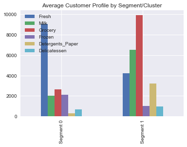


### Question 8
Consider the total purchase cost of each product category for the representative data points above, and reference the statistical description of the dataset at the beginning of this project. *What set of establishments could each of the customer segments represent?*  
**Hint:** A customer who is assigned to `'Cluster X'` should best identify with the establishments represented by the feature set of `'Segment X'`.


```python
print("Average Total Value of a customer in each segment :\n")
print(true_centers.sum(axis=1))
true_centers.append(median).transpose().plot(kind="bar", title = "Average Segement Customer spending vs. Median Spending in each Category")
```

    Average Total Value of a customer in each segment :
    
    Segment 0    16816.0
    Segment 1    25872.0
    dtype: float64
    


    <matplotlib.axes._subplots.AxesSubplot at 0xea13198>


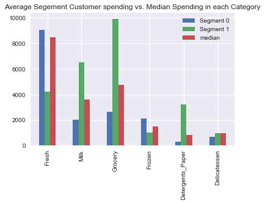


**Answer:**

- Segment 0: Likely to be **Markets and Fast-Food outlets**. Customers in this segment spend a lot, and predominantly on the **Fresh category** and also on the **Frozen category**. Their spending in Fresh category (~9000 m.u.)is more than double the spending  by Segment 1 customers in this category and it is a few hundred dollars more than the median spending in this category.   They also spend more than the both the median customer and the average Segment 1 customer in the Frozen category


- Segment 1: Likely to be **Supermarkets and Grocery Stores**. These customers spend significanlty on the **Grocery, Milk and Detergent_Paper** categories. In all 3 categories, they spend at least twice as much as the median customer and over 3 times the spending of a Segment 0 customer in each category.

Overall, the Segement 1 customers have a higher spending value per year: almost 26K m.u. vs. the ~17K m.u. for Segment 0. Generally the Delicatessen category spending in low and both Segments spend roughly the same in this category.

### Question 9
*For each sample point, which customer segment from* ***Question 8*** *best represents it? Are the predictions for each sample point consistent with this?*

Run the code block below to find which cluster each sample point is predicted to be.


```python
# Display the predictions
for i, pred in enumerate(sample_preds):
    print "Sample point", i, "predicted to be in Cluster", pred
```

    Sample point 0 predicted to be in Cluster 1
    Sample point 1 predicted to be in Cluster 0
    Sample point 2 predicted to be in Cluster 0
    


```python
samples
```


<div>
<style>
    .dataframe thead tr:only-child th {
        text-align: right;
    }

    .dataframe thead th {
        text-align: left;
    }

    .dataframe tbody tr th {
        vertical-align: top;
    }
</style>
<table border="1" class="dataframe">
  <thead>
    <tr style="text-align: right;">
      <th></th>
      <th>Fresh</th>
      <th>Milk</th>
      <th>Grocery</th>
      <th>Frozen</th>
      <th>Detergents_Paper</th>
      <th>Delicatessen</th>
    </tr>
  </thead>
  <tbody>
    <tr>
      <th>0</th>
      <td>4484</td>
      <td>14399</td>
      <td>24708</td>
      <td>3549</td>
      <td>14235</td>
      <td>1681</td>
    </tr>
    <tr>
      <th>1</th>
      <td>3</td>
      <td>333</td>
      <td>7021</td>
      <td>15601</td>
      <td>15</td>
      <td>550</td>
    </tr>
    <tr>
      <th>2</th>
      <td>22096</td>
      <td>3575</td>
      <td>7041</td>
      <td>11422</td>
      <td>343</td>
      <td>2564</td>
    </tr>
  </tbody>
</table>
</div>


**Answer:**
- Sample 0 is best represented by **Segment 1** because it has very high Grocery, Milk, and Detergents_Paper spending. The overall spending is also very high, characteristic of Segement 1 as stated in Question 8. See also answer to Question 1 which is consistent with this finding.

- Sample 1 is best represented by **Segment 0** because it has very high Frozen category spending. See also answer to Question 1 which is consistent with this finding.

- Sample 2 is also best represented by **Segment 0**, given its very high spending in the Fresh category as well as significant spening in the Frozen category as well. See also answer to Question 1 which is consistent with this finding.

The predictions produced by the clustering are also consistent with the the findings above, and at the beginning of the exercise

## Conclusion

In this final section, you will investigate ways that you can make use of the clustered data. First, you will consider how the different groups of customers, the ***customer segments***, may be affected differently by a specific delivery scheme. Next, you will consider how giving a label to each customer (which *segment* that customer belongs to) can provide for additional features about the customer data. Finally, you will compare the ***customer segments*** to a hidden variable present in the data, to see whether the clustering identified certain relationships.

### Question 10
Companies will often run [A/B tests](https://en.wikipedia.org/wiki/A/B_testing) when making small changes to their products or services to determine whether making that change will affect its customers positively or negatively. The wholesale distributor is considering changing its delivery service from currently 5 days a week to 3 days a week. However, the distributor will only make this change in delivery service for customers that react positively. *How can the wholesale distributor use the customer segments to determine which customers, if any, would react positively to the change in delivery service?*  
**Hint:** Can we assume the change affects all customers equally? How can we determine which group of customers it affects the most?

**Answer:**
Looking at the categories and how they are related to customer segments changing frequency of delivery will not affect all customers the same. Using our categories, Segment 0 customers will likely be affected negatively as their businesses are more likely to be dependent on whether their product is fresh or not. Consider a market that needs to sell fresh tomatoes or meat everyday, if they suddenly start getting delivery 3 times a week then they would have to order more quantities on a single order to cover for the days that deliveries do not come. That will also mean they will be selling meat that is more than a day old which is not good for their business. 

So, Segement 0 will likely respond negatively. If there are any positive reactions, they would likely come from Segment 1 customers as their products are less likely to be time-sentive which reduces the need for fresh deliveries.

**Proposed approach to use A/B Testing**:

**Goal** : Given the context and customer segments, determine which customers would react positively to a change in delivery service frequency from 5 to 3 days a week.

**Methodology**: 

- **Experimental Set-Up**: A/B Testing for this wholesaler would best start with a two-pronged setup for where Segment 1 is the treatment group and Segment 0 will be the control group.   

- Pick a **sample of customers from each segment** for which to implement the proposed change in delivery service. It is advisable to pick the smallest sample sufficient to show significant results (since we know that there is a potential cost to implementing the new delivery schedule to the wrong group of customers - as stated in the project description). The sample size requirements will depend on the balance of the sampled data. If it is imbalanced i.e. if a low proportion of customers are likely to give positive feedback, then we would need a bigger sample to test on. However, once it starts getting very big, and we are not detecting sizeable difference, the new scheme is probably not a good idea and should not be implemented.

- **Run experiment**: the wholesaler should then implement the new scheme to these two sample groups and collect realiable feedback from the sample customers from each group using a survey or other reliable means for feedback. The survey should ask about levels of customer satisfaction or dissatisfaction with the new scheme and corresponding reasons.

- The **timing/duration** for the experiment is also important and should be long enough to get good data e.g. one month would give about 4 weeks of delivery per customer and thus an opportunity to get 4 sets of feedback which can then be averaged for a more robust, representative result. 

**Interpreting the results**: 

- Let's say the wholesaler choses to run the experiment on 35 randomly selected customers in each segment. We know there are a total of 431 customers (244 in Segment 0 and 187 in segment 1 - See cell below with calculations). Suppose 25 out of 35 from segement 1 give positive feedback for the new scheme and only 10 out of 35 from segement 0 give positive feedback. We assume a null hypothesis: the rates of positive feedback about the new scheme is independent of which segment the customer is from. Running a Chi-squared test on this imaginary example (see calculations below) we get chisq-value = 4.725 and  p-value = 0.0297271833061. Since p < 0.05 so we can reject the null hypothesis. This means that the difference is positive feedback depends on the segment, in this dummy case, segment 1 gives significantly more positive feedback thus we can roll out the scheme to the customers in segment 1!
- Finally, we should still be cautious about further segmentation within our existing segments. We can conduct more A-B tests, even within segment 1 which has the low positive feedback rate. Maybe those who buy Fresh category vs. those who buy more Frozen have different needs? This reminds us of the PCA 4 dimensions which explain 93% of the variation. By using only the first two, we capture 70% of the variation but if we add the other two, we get more information. So although, we can roll this to our Segment 1 customers first, there may be more opportunity to further cluster Segment 0 and perhaps pinpoint another sub-segment that might appreciate the new scheme. 

#### A-B Testing Number of Customers by Segment


```python
n_tot = len(preds)
n_seg1 = preds.sum()
n_seg0 = n_tot - n_seg1
print("Total Number of Customers (after removing outliers): {} \n---".format(n_tot))
print("Segment 0 Customers : {} \n---".format(n_seg0))
print("Segment 1 Customers : {} \n---".format(n_seg1))
```

    Total Number of Customers (after removing outliers): 431 
    ---
    Segment 0 Customers : 244 
    ---
    Segment 1 Customers : 187 
    ---
    

#### A-B Testing Example Calculation - Referenced in "Interpretating the results" in Q10 above 


```python
# import the relevant libraries
import pandas as pd
import os
from scipy.stats import chi2_contingency

# import the data and reset index
ab_data = pd.DataFrame({'Segment':pd.Series([0,1]), 'Negative':pd.Series([15,20]), 'Positive':pd.Series([25,10])})
ab_data = ab_data.set_index('Segment')

# chi2 will only take an array?
observed = ab_data.values
print("Contingency Matrix:\n---\n {}\n---".format(observed))

# calculate and print the result of the Chi-Squared Test of Independence
result = chi2_contingency(observed)
chisq, p = result[:2]
print('chisq = {}, p = {}'.format(chisq, p))
```

    Contingency Matrix:
    ---
     [[15 25]
     [20 10]]
    ---
    chisq = 4.725, p = 0.0297271833061
    

### Question 11
Additional structure is derived from originally unlabeled data when using clustering techniques. Since each customer has a ***customer segment*** it best identifies with (depending on the clustering algorithm applied), we can consider *'customer segment'* as an **engineered feature** for the data. Assume the wholesale distributor recently acquired ten new customers and each provided estimates for anticipated annual spending of each product category. Knowing these estimates, the wholesale distributor wants to classify each new customer to a ***customer segment*** to determine the most appropriate delivery service.  
*How can the wholesale distributor label the new customers using only their estimated product spending and the* ***customer segment*** *data?*  
**Hint:** A supervised learner could be used to train on the original customers. What would be the target variable?

**Answer:**
Since we have already segmented existing customers into 2 segments, these segments can then become the target variable which we need to predict from the new customers estimated product spending across each of the wholesalers product categories. We will train a classifier (KNN, SVM, Logistic Regression etc.) on the existing customer data (performing train-test-split or cross-validation of course) to determine the best final model. We can then use this model to predict on the test set of new customers to determine the segments for each of them. We can then use these to make decisions on which delivery scheme to put each of the new customers on.

### Visualizing Underlying Distributions

At the beginning of this project, it was discussed that the `'Channel'` and `'Region'` features would be excluded from the dataset so that the customer product categories were emphasized in the analysis. By reintroducing the `'Channel'` feature to the dataset, an interesting structure emerges when considering the same PCA dimensionality reduction applied earlier to the original dataset.

Run the code block below to see how each data point is labeled either `'HoReCa'` (Hotel/Restaurant/Cafe) or `'Retail'` the reduced space. In addition, you will find the sample points are circled in the plot, which will identify their labeling.


```python
# Display the clustering results based on 'Channel' data
vs.channel_results(reduced_data, outliers, pca_samples)
```


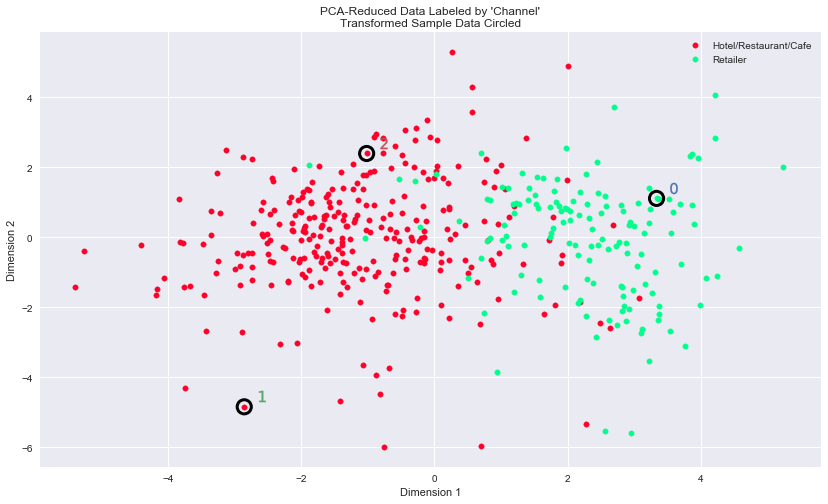


### Question 12
*How well does the clustering algorithm and number of clusters you've chosen compare to this underlying distribution of Hotel/Restaurant/Cafe customers to Retailer customers? Are there customer segments that would be classified as purely 'Retailers' or 'Hotels/Restaurants/Cafes' by this distribution? Would you consider these classifications as consistent with your previous definition of the customer segments?*

**Answer:**
- The clustering algorithm (GMM) and number of clusters (2) is well-aligned with the underlying distibution of Hotel/Restaurant/Cafe vs. Retail customer structure shown above. We can see a separation of green and red points in the chart, although it is not perfect it is very strong. 
- The customer segments are not purely split across the Channel distribution, though. There are quite a number of Hotels/Restaurant/Cafes that fall in Segment 1 and a few Retailers clustered as Segment 0. 
- Yes, the evidence suggests that these classifications are consistent with my definitions of these segements. While I classfied Segment 0 as Markets and Fast-Food outlets, these are very similar to Hotels/Restaurants/Cafes. Also Segment 1 Groceries and Supermarkets is consistent with the Retailers class.


> **Note**: Once you have completed all of the code implementations and successfully answered each question above, you may finalize your work by exporting the iPython Notebook as an HTML document. You can do this by using the menu above and navigating to  
**File -> Download as -> HTML (.html)**. Include the finished document along with this notebook as your submission.
